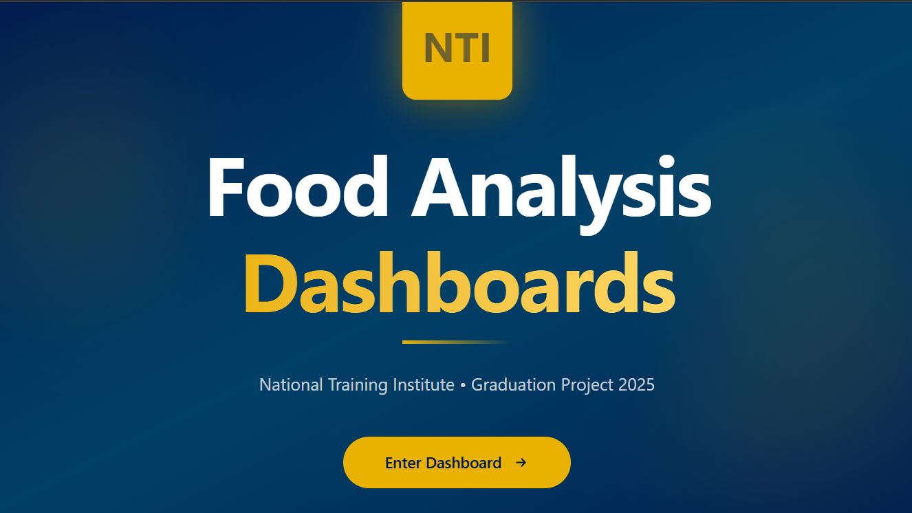
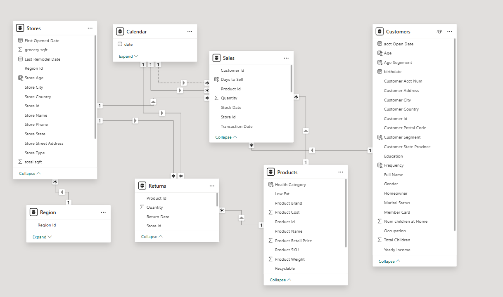
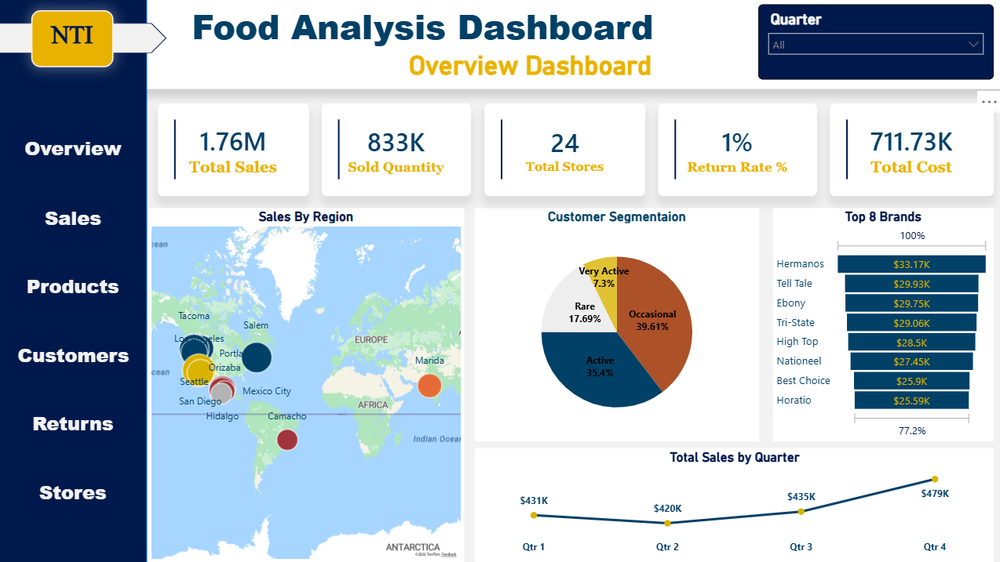
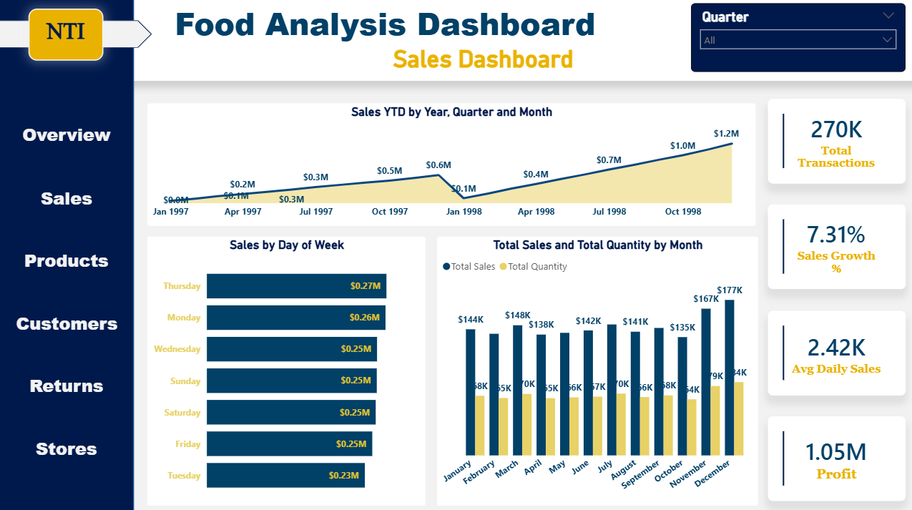
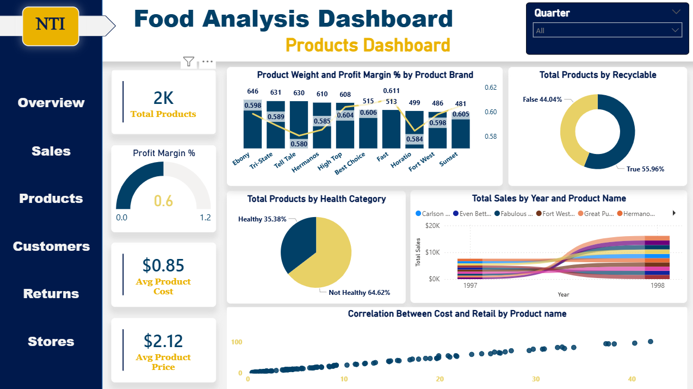
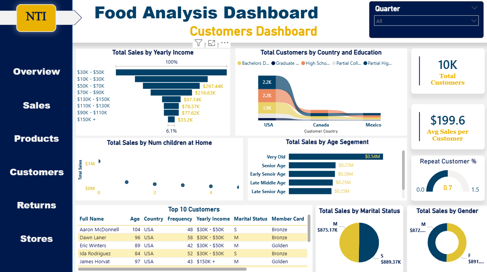
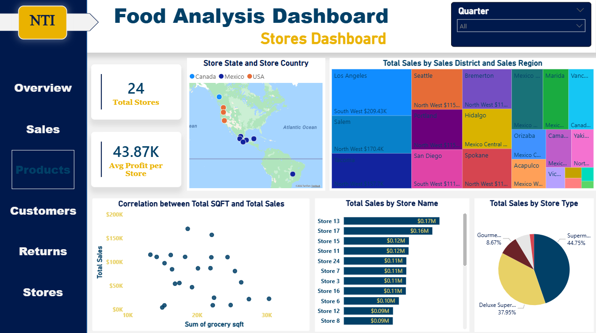
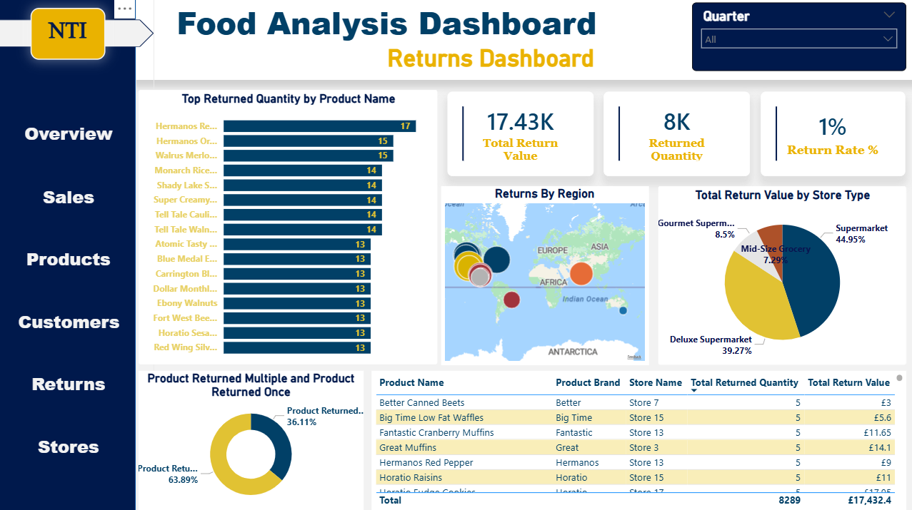

# 🍽️ Food Analysis  
**Powered by Python, SQL and Power BI — Built for the NTI Graduation Project**

---

## 📌 Project Overview
This project is a **graduation project for the Data Analysis track at NTI**.
It focuses on analyzing food sales and returns data to evaluate business performance,
understand customer behavior, and extract actionable insights.

The project demonstrates a complete end-to-end data analysis workflow,
from data preparation and validation to insight-driven dashboards.

---

## 🗂️ Dataset Description
The dataset consists of multiple related tables, each representing a key business entity
within the food sales domain:

| Dataset Name   |                                            Description                                             |
|----------------|----------------------------------------------------------------------------------------------------|
| **Sales**      | Contains detailed records of food sales transactions, including quantities, prices, and dates.     |
| **Returns**    | Stores information about returned products, returned quantities, and return transactions.          |
| **Products**   | Includes product details such as category, cost, price, health classification, and recyclability.  |
| **Customers**  | Contains customer demographic and behavioral information used for segmentation and analysis.       |
| **Stores**     | Includes store-level information such as store type, size, and location.                           |
| **Regions**    | Represents geographical regions used to analyze sales distribution across different areas.         |
| **Calendar**   | Date dimension table used for time-based analysis such as trends, monthly, and yearly comparisons. |

---

## 🛠 Tools & Technologies
- **SQL**: Data validation, aggregation, and analytical queries  
- **Python**: Advanced analysis (RFM analysis, product association analysis)  
- **Power BI**: Data modeling, DAX measures, dashboards, and insights  

---

## 🔄 Data Preparation & Validation
- **Power Query** was used for data cleaning, transformation,
  handling missing values, and building the data model.
- **SQL** was used for data validation, consistency checks,
  and analytical queries.
- **Python** was used for advanced analysis beyond dashboards.

---

## Data Modeling

The project includes a structured data modeling approach to organize and prepare the data for analysis. The main components of the model are:

- **Fact Tables**: Contain measurable, quantitative data (e.g., Sales, Returns, Profits).  
- **Dimension Tables**: Contain descriptive attributes (e.g., Customers, Products, Stores, Calender).  
- **Relationships**: Fact tables are linked to dimensions using primary/foreign keys to ensure efficient analysis and reporting.

The following diagram shows the overall data model:

---

## 📊 Dashboards & Key Insights
The project includes **6 Power BI dashboards**, each focusing on a specific business area
and delivering insights in a simple, business-oriented way.

### 1️⃣ Overview Dashboard

- Provides a high-level snapshot of overall business performance by combining Sales, Units Sold, Number of Stores, Return Rate %, and Total Costs.
- It highlights:
    - Sales distribution across regions
    - Customer activity segmentation
    - Top-selling products
    - Sales trends over time.

---

### 2️⃣ Sales Dashboard

- Analyzes Sales performance and Profitability by examining Transactions, Growth Trends, Average Daily Sales, and Total Profit.
- It highlights:
    - Year-to-Date sales behavior
    - Sales Patterns across Weekdays
    - Monthly Sales and Quantity trends to identify peak and low performance periods.

---

### 3️⃣ Products Dashboard

- Focuses on product performance by analyzing Pricing, Costs, and Profitability.
- It explores:
    - Product Distribution by Health category
    - Recyclable versus Non-Recyclable products
    - The relationship between Product Cost and Retail Price to understand margin behavior.

---

### 4️⃣ Customers Dashboard

- Provides insights into customer behavior by analyzing Customer value, Repeat purchase behavior and Average Sales per Customer.
- It examines:
    - Demographic patterns such as Age, Income, Gender, and Marital Status,
    - Explores How Household size impacts Total Sales.

---

### 5️⃣ Stores Dashboard

- Evaluates store-level performance by comparing Sales and Profitability across stores.
- It highlights:
    - Top-performing Stores
    - Differences between store types
    - Examines whether Store size has a meaningful impact on Total Sales : Showing that store area does not necessarily lead to higher sales.

---

### 6️⃣ Returns Dashboard

- Analyzes Return behavior and its impact on business performance.
- It identifies:
    - Products with the highest return quantities
    - Compares One-Time versus Multiple Returns
    - Provides detailed insights by Product and Category to highlight potential quality or operational issues.

---

## 🧠 Advanced Analysis (SQL & Python)
In addition to dashboards, SQL and Python were used to perform deeper analysis, including:
- **RFM Analysis** to segment customers based on recency, frequency, and monetary value
- **Product Association Analysis** to identify products frequently purchased together
  and support cross-selling and bundling strategies

---

## 📂 Repository Structure
- `data/` : Sales and returns datasets  
- `sql/` : SQL queries used for validation and analysis  
- `python/` : Python notebooks for advanced analysis  
- `powerbi/` : Power BI dashboard file  
- `images/` : Dashboard screenshots  

---

## 🚀 Conclusion
This project demonstrates how combining SQL, Python, and Power BI can transform raw food sales data into clear, actionable business insights.
The analysis supports better decision-making across sales, products, customers, stores, and returns.
